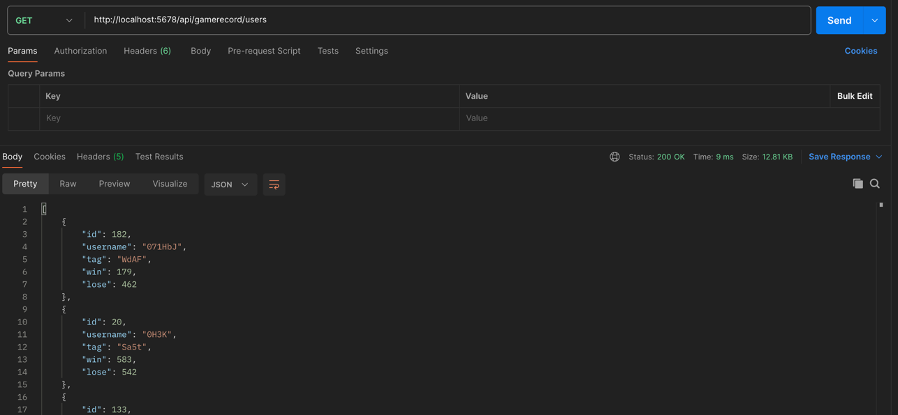
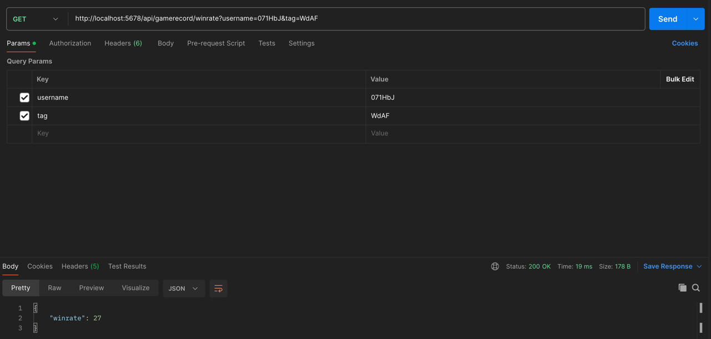

# CheckGameOdds
> 본 문서를 통해 '게임 승률 조회하기' 프로그램을 구현하기 위한 구조와 사용된 기술에 대한 설명을 하고자 한다.

## 1. 프로젝트 설명
이 프로젝트는 게임 승률을 확인 서비스이다.
구현된 기능은 다음과 같다.
1. 유저들의 목록을 조회하는 기능
2. `username`과 `tag`에 맞는 유저의 승률을 조회하는 기능

## (사용한) 프로젝트 구조
```
/project
    /src
        /main
            /java
                /gamerecord
                    controller
                        GameRecordController.java
                    CheckGameOddsApplication.java
                    
            /resources
                application.properties
    /data
        /input
            records.json
```

## 사용한 annotation에 대한 설명
`@SpringBootApplication`
Spring Boot 애플리케이션임을 나타내기 위한 어노테이션이다.
`@GetMapping`
해당 어노테이션에 대한 메서드가 HTTP GET 요청을 처리한다는 것을 의미한다. 

## GameRecordController.java 구현 과정
### 📌 ResponseEntity<?>
* Java에서 제네릭(Generic) 타입으로, 메서드가 HTTP 응답을 반환할 때 사용된다.
  * 제네릭 타입은 특정 타입을 미리 정해주는 것이 아니라, 필요에 의해 지정할 수 있도록 하는 일반(generic) 타입인 것이다 
* '<?>'는 반환 타입이 정해지지 않았음을 의미한다. 

### 📌 List<Map<String,Object>>
* 맵 객체들을 담는 리스트이다. 
* 마찬가지로 제네릭 타입으로 선언되어 있다. 
* 맵의 키는 String이고, 값은 Object이다.

### 📌 user 목록을 username과 tag를 기준으로 정렬
* 스트림 생성 `users.stream()`
  > ### 스트림(Stream)이란?
  > 데이터 컬렉션(list, set, map같은 것들)을 처리하기 위한 현대적인 방법이다.    
  > 병렬 처리를 쉽게 구현할 수 있다. 즉, 리스트에 대한 여러 작업을 '동시에' 처리할 수 있다. => 코드 간결, 가독성 up
* 스트림 중간 연산(Intermediate Operations)
  * sorted를 사용하여 stream의 요소들을 정렬한다. 
  * Comparator.comparing(...)을 사용하여 username을 기준으로 먼저 정렬하고, .thenComparing(...)을 통해 username이 동일한 경우 tag를 기준으로 정렬한다. 
  * (Map<String, Object> user -> (String) user.get("username")
    * `user` map에서 username이라는 키의 값을 가져오고, String으로 캐스팅한다.
* 스트림 종료 연산(Terminal Operation)
  * `.collect(Collectors.toList())`
  * 스트림의 요소를 리스트(`toList()`)로 수집한다.

### 📌 username과 tag에 맞는 유저의 승률을 조회
* 루프를 통해 users 리스트에서 if문 조건에 맞는 사용자를 찾는다. 
* 이후 해당 사용자의 win, lose 값을 계산한 후 winrate를 계산하여 리턴

## Postman 실행 결과
* 전체 유저 조회 

* username과 tag 정보와 일치하는 유저의 승률 조회
